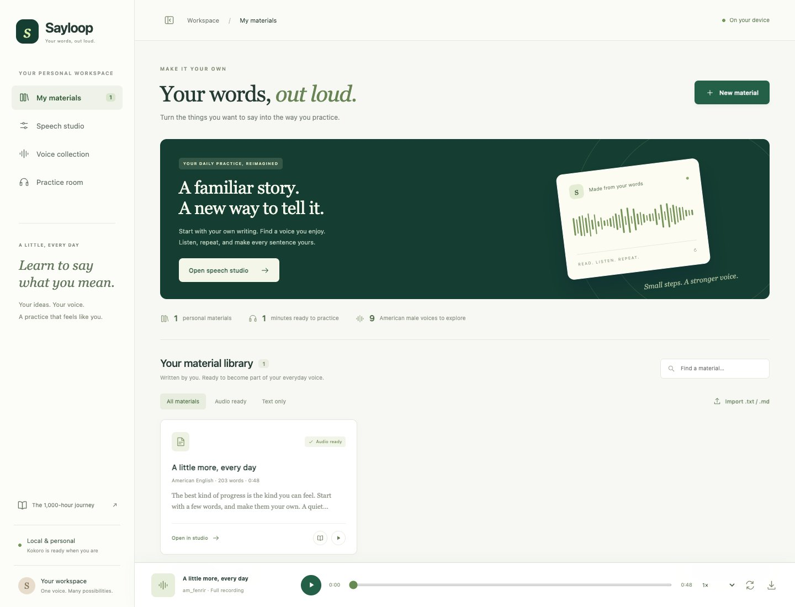
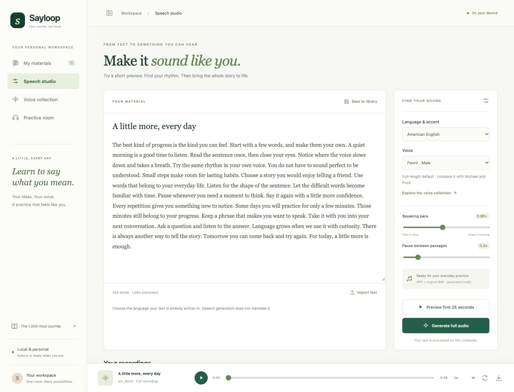
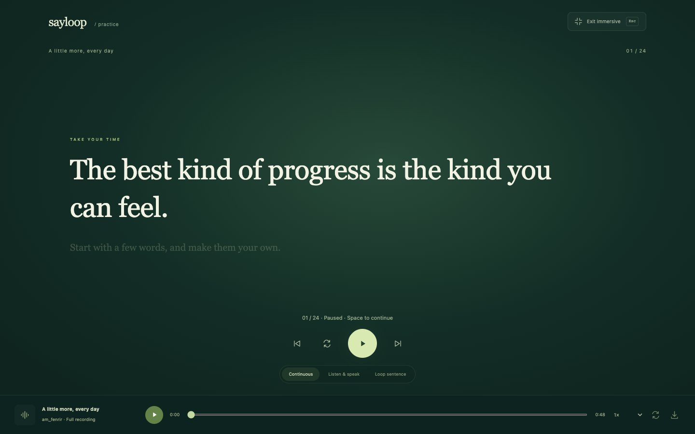
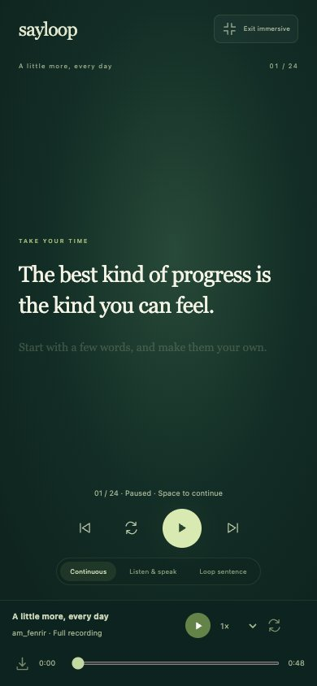

# Sayloop

[English](README.md) | **简体中文**

**把你想说的话，变成可以反复练习的声音。** Sayloop 是运行在自己电脑上的语音工作台与语言练习室。

写下自己的文章，使用 [Kokoro-82M](https://huggingface.co/hexgrad/Kokoro-82M) 生成语音，再逐句听、说、重播。无需付费语音 API 或账号。项目源码已公开；不包含作者的个人学习材料、录音或模型权重。

## 可以做什么

- 粘贴文本，或导入 UTF-8 `.txt`、`.md` 文件。
- 选择 54 个声音、九种语言/口音选项，包括九个美式男声。
- 先生成最长 25 秒的试听，再生成完整录音。
- 调整语速、段落停顿，下载 MP3、WAV 或包含文本的录音 ZIP。
- 同步高亮当前句子，自动滚动跟随字幕。
- 连续听、听一句停一下自己读，或循环练习同一句。
- 使用大字沉浸模式、键盘控制和可折叠侧栏。
- 文本与录音保存在自己的磁盘，草稿和界面偏好保存在浏览器中。

语音生成不负责翻译，请选择与文本一致的语言。Kokoro 没有情感强度滑块。英文逐句时间来自模型时长估计，其他语言目前按合成段落练习。

## 界面预览

以下截图均使用人工构造的演示文本，不含个人学习资料。

**语料库：** 把自己的文章整理成随时可以练习的材料。



**语音工作台：** 选择声音、调整语速、先试听再生成全文。



**沉浸练习：** 当前句子大字高亮，听完停下，自己读完再继续。



<details>
<summary>查看手机尺寸的练习界面</summary>



已验证 Chrome 手机尺寸模拟；实体 iOS/Android 设备尚未验收。
</details>

## 本地启动

原生方式已在 Apple Silicon、Python 3.11 上测试。先安装 [uv](https://docs.astral.sh/uv/) 和 FFmpeg；macOS 可用 `brew install ffmpeg`。

```sh
git clone https://github.com/BillLucky/sayloop.git
cd sayloop
./scripts/setup.sh
.venv/bin/python scripts/serve.py
```

打开 **http://127.0.0.1:8765**。macOS 也可以双击 `start.command`，后台启动并打开网页。Node 仅用于开发检查，不是运行网页的必要条件。无需 GitHub 账号即可通过 HTTPS 克隆公开源码。

安装脚本优先复用 Hugging Face 模型缓存，并准备英文语言模型与日文字典。日文字典首次下载约 526 MB。完整初始化后可离线生成，设置 `HF_HUB_OFFLINE=1` 可禁止 Hugging Face 下载。

```sh
# 后台启动 / 停止空闲服务
.venv/bin/python scripts/serve.py --background
.venv/bin/python scripts/stop.py
# 导入自己的材料，保留原文件
.venv/bin/python scripts/import_materials.py /path/to/your/texts
# 批量生成美式男声试听及全文录音
.venv/bin/python scripts/generate_library.py --voice am_fenrir
# 导出到自己的本地磁盘；不要上传个人导出包
.venv/bin/python scripts/export_library.py
```

## Docker 启动

```sh
docker compose build
docker compose run --rm sayloop python scripts/download_model.py
docker compose up -d --wait
```

打开同一个本地网址，语料库初始为空，导入自己的文字即可。模型单独下载到持久化数据卷。详见 [Docker 安装、离线运行和备份恢复](docs/DOCKER.md)。本项目不发布预构建镜像或个人音频包。

## 练习控制

| 操作 | 控制方式 |
| --- | --- |
| 暂停、继续；逐句暂停后进入下一句 | `Space` 空格 |
| 上一句 / 下一句 | `←` / `→` |
| 重播当前句 | `R` |
| 进入 / 退出沉浸模式 | `F` / `Esc` |
| 每句结束后停下，留时间自己读 | **Listen & speak** |
| 循环练习同一句 | **Loop sentence** |
| 自动让当前字幕保持可见 | **Auto-follow** |

输入文字、操作输入控件或使用输入法时不拦截快捷键。点击句子可定位播放。全文结束后空格从头开始，`R` 重播最后一句。听力时间仅作参考，不代表实际开口练习时长。

## 开发与文档

```sh
npm ci --ignore-scripts
npm test && npm run check && npm run format:check
.venv/bin/python -m pytest -q
.venv/bin/ruff check app scripts tests
.venv/bin/ruff format --check app scripts tests
npx playwright install chromium
npm run test:browser
python3 scripts/privacy_check.py --history
```

- [中文使用指南](docs/USER_GUIDE.zh-CN.md) · [交付索引](docs/DELIVERY.zh-CN.md)
- [架构与实现](docs/ARCHITECTURE.md) · [运维、备份、迁移与打包](docs/OPERATIONS.md)
- [真实验证记录](docs/VALIDATION.md) · [开源准备与依赖更新](docs/OPEN_SOURCE.md)
- [贡献指南](CONTRIBUTING.md) · [隐私与安全边界](SECURITY.md) · [更新日志](CHANGELOG.md)

程序面向个人使用，默认只监听本机，没有账号认证层，请勿直接暴露到公网。具体已验证的平台见验证记录；不把手机尺寸模拟当作实体设备测试。

## 协议与致谢

当前应用源码采用 [Apache-2.0](LICENSE)。第三方依赖和模型保留各自协议，包含 GPL/LGPL 等组件，详见 [第三方说明](THIRD_PARTY_NOTICES.md)。应用协议不替代模型、字典或用户文本的权利要求。

练习流程受到[李笑来](https://github.com/xiaolai)的 [《一千小时》](https://1000h.org/why.html)及其[启动任务](https://1000h.org/training-tasks/kick-off.html)启发：准备对自己有意义的内容，听、说、重复。感谢作者与 [人人都能用英语 / Enjoy 社区](https://github.com/ZuodaoTech/everyone-can-use-english)公开分享方法和工程。Sayloop 是独立实现，不代表原作者或社区的官方项目或背书，详见[致谢](docs/ACKNOWLEDGEMENTS.md)。个人语料与音频不随源码发布。
