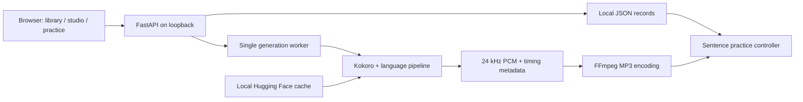

# Architecture

## Runtime

Sayloop is a single-process FastAPI application. Uvicorn serves both the API and browser-native ES modules. There is no frontend build step, cloud inference, analytics, or external font dependency. Python 3.11 dependencies are pinned in `requirements.lock`; frontend formatting is pinned in `package-lock.json`.

## Source map

| Path | Responsibility |
| --- | --- |
| `app/main.py` | Validated HTTP contracts, upload/download, same-origin writes, local host restrictions |
| `app/config.py` | Language/voice catalog, paths, pinned model revision |
| `app/storage.py` | UUID records, atomic JSON replacement, material snapshots |
| `app/jobs.py` | Single-worker queue, persisted progress, failure/restart states |
| `app/engine.py` | Lazy model loading, bounded text chunks, synthesis, waveform validation, MP3 encoding |
| `app/alignment.py` | English sentence boundaries using Kokoro token timestamps |
| `web/app.js` | Views, editor, queue updates, player binding, keyboard and follow-scroll behavior |
| `web/practice-player.js` | Media-independent playback state machine, tested with Node's native test runner |
| `web/base.css`, `web/practice.css` | Responsive workspace and immersive practice styles |

## Generation and persistence

The browser saves a material snapshot before submitting generation. Editing creates a new version; existing texts and recordings remain available. Requests carry a language, voice, speed (0.5–1.5), passage pause (0–2 seconds), and preview/full mode. A supplied material ID must match the submitted text.

One worker serializes synthesis and reuses one model plus one pipeline per language. The pending queue is capped at 20 tasks. Each job moves through `queued → running → completed/failed`; startup marks unfinished jobs `interrupted` and exposes Retry. Run **one Uvicorn worker**. JSON files are not a multi-process database.

Model lookup first uses `KOKORO_MODEL_DIR`, otherwise the pinned Hugging Face cache revision. A cache miss can download the required weights and voices; offline mode reports an actionable error instead. CPU with four Torch threads is the default. MLX was evaluated as a possible alternative but was not implemented: the existing PyTorch weights already synthesize substantially faster than playback on the tested Apple Silicon machine.

Text is normalized from Markdown and split into bounded passages. Preview uses the opening text and caps output at 25 seconds with a short fade; short input produces a shorter preview. Full generation retains all passages and inserts the selected silence between them. Audio is checked for finite samples and normalized only if its peak would clip. WAV is PCM16 at 24 kHz; MP3 is encoded at 128 kbps.

## Sentence playback

English sentence boundaries are derived from Kokoro's predicted token durations. Synthesis still uses longer passages for prosody, rather than rendering every short sentence separately. These are model-estimated timings, not independently forced-aligned timestamps. Non-English output currently falls back to synthesis passage boundaries.

`PracticePlayer` owns the selected sentence, playback mode, and pending turn-taking pause. All mouse and keyboard actions call the same controller. In Listen & speak mode, reaching a sentence boundary pauses playback and keeps the completed sentence highlighted; Space explicitly releases the next sentence. R seeks to the current sentence start. Loop mode seeks back without advancing the selection.

A foreground animation frame checks boundaries for precise interaction; `timeupdate` provides fallback updates. Browser background throttling can reduce boundary precision. Automatic scrolling runs only when the selected sentence changes and is outside the visible reading area. Reduced-motion preferences disable smooth scrolling. Space is intercepted in the capture phase, including keyup, so a focused sentence button cannot also replay through its native click behavior.

## Extension points

Another TTS engine should implement the current audio/segment result contract. Network multi-user deployment requires authentication, authorization, isolated data ownership, upload limits, and a durable job queue before exposing this application beyond a trusted host. Translation, microphone recording, pronunciation scoring, and cloud accounts are outside the current release.
